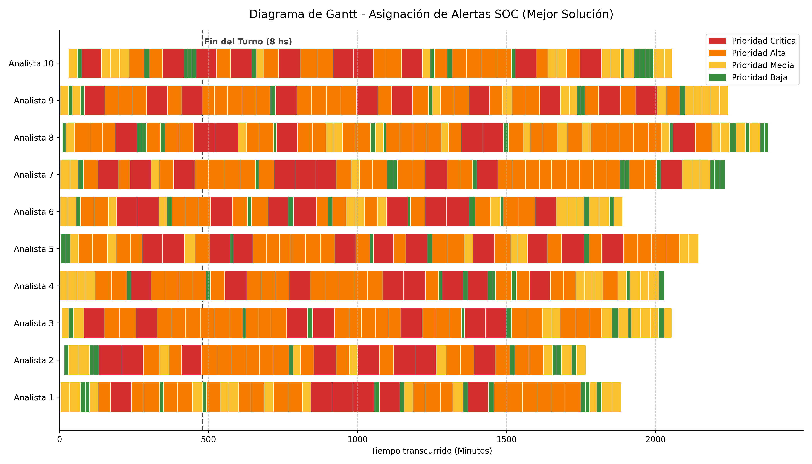

# 🧬 TPI - Optimización de Asignación de Alertas SOC con Algoritmos Genéticos

Bienvenido al repositorio del Trabajo Práctico Integrador para la cátedra de Algoritmos Genéticos (UTN FRRo).
Este proyecto aborda un problema crítico de ciberseguridad en el mundo real: el *Job Shop Scheduling* de alertas en un Centro de Operaciones de Seguridad (SOC), garantizando que las amenazas más severas se atiendan a tiempo sin sobrecargar a los analistas.



## 📌 Resumen del Proyecto

El proyecto modela la asignación de 500 alertas reales de red a un equipo de 10 analistas. A lo largo del desarrollo, hemos pasado desde un enfoque clásico hasta la integración de optimizaciones empíricas y arquitecturas modernas.

**Características Principales:**
- **Datos Reales:** Utiliza el dataset público **CICIDS2017** para las alertas (simulando ataques DDoS).
- **Core Clásico:** Implementa un **Algoritmo Genético Canónico** con selección por ranking, crossover de 1 punto, mutación por gen y elitismo (`main.py`).
- **Validación Empírica:** Cuenta con un Sintonizador de Hiperparámetros (Grid Search) y una comparación *Baseline* contra un asignador tradicional (Round-Robin).
- **Visualización:** Incluye un Dashboard Interactivo construido en **Streamlit** para presentar los resultados de forma visual y profesional.

---

## 🏗️ Arquitectura del Repositorio

| Archivo / Carpeta | Descripción |
|------------------|-------------|
| `main.py` | Motor del Algoritmo Genético Canónico (Requisito Académico). |
| `hyper_tuner.py` | Script de Grid Search para justificar empíricamente las tasas de mutación y crossover. |
| `baseline_comparacion.py` | Script que compara nuestro AG contra un asignador tradicional (Round-Robin). |
| `dashboard.py` | Interfaz gráfica interactiva hecha en Streamlit para exponer resultados. |
| `docs/` | Documentación académica: `informe.html`, `articulo_v2.tex` y guía de defensa. |
| `outputs/` | Archivos CSV generados y gráficos (`figures/`). |

---

## Guía rápida de instalación y uso

Todos los comandos de esta sección se ejecutan desde la carpeta `TPI`.

### 1. Instalar dependencias
Requiere Python 3. Instalá las dependencias con:
```bash
python -m pip install -r requirements.txt
```

### 2. Ejecutar el algoritmo
Para ejecutar la corrida completa:
```bash
python main.py
```
Esto genera el resumen, las métricas generacionales, la distribución final y los gráficos en `outputs/`.

Para probar rápidamente que todo funciona:
```bash
python main.py --tam-poblacion 5 --n-generaciones 3
```

### 3. Comparar con los baselines
Después de ejecutar `main.py`, generá la comparación:
```bash
python baseline_comparacion.py
```
El script actualiza `outputs/comparativa_baselines.csv` y genera tres gráficos en `outputs/figures/`.

### 4. Ver los resultados
Los archivos más importantes son:
- `outputs/resumen_resultados_soc.csv`: mejor solución y métricas globales.
- `outputs/metricas_generacionales_soc.csv`: evolución por generación.
- `outputs/distribucion_final_alertas_soc.csv`: carga final por analista.
- `outputs/comparativa_baselines.csv`: comparación entre baselines y AG.
- `outputs/figures/`: gráficos PNG de evolución, carga, Gantt y comparación.

Los gráficos de comparación actuales son:
- `espera_critica_comparativa.png`
- `backlog_comparativa.png`
- `desbalance_comparativa.png`

### 5. Abrir el dashboard
El dashboard lee los archivos de `outputs/`; no ejecuta el algoritmo en vivo. Para actualizar los datos antes de abrirlo, ejecutá primero `main.py` y, opcionalmente, `gantt_chart.py` y `baseline_comparacion.py`.

Para iniciar Streamlit:
```bash
python -m streamlit run dashboard.py
```
Después abrí la dirección que muestra Streamlit, normalmente `http://localhost:8501`. Para detenerlo, presioná `Ctrl+C` en la terminal.

### 6. Regenerar el PDF del paper
Requiere tener `pdflatex` disponible. Desde `TPI`:
```bash
cd docs
pdflatex -interaction=nonstopmode -halt-on-error articulo_v2.tex
pdflatex -interaction=nonstopmode -halt-on-error articulo_v2.tex
```
El PDF actualizado queda en `docs/articulo_v2.pdf`. Los archivos `.aux`, `.log` y `.out` son regenerables y están ignorados por `TPI/.gitignore`.

---

## 🎓 Documentación Académica

La documentación requerida por la cátedra se encuentra en la carpeta `docs/`:
1. **Documento Guía de Investigación**: Informe principal en HTML con la situación problemática, modelo y objetivos (`docs/informe.html`).
2. **Artículo Científico**: Formato de paper IEEE (`docs/articulo_v2.tex`).
3. **Machete de Defensa**: Guía estructurada para estudiar de cara a la exposición oral (`docs/guia_estudio_defensa.md`).

---
**Universidad Tecnológica Nacional — Facultad Regional Rosario**  
Cátedra Algoritmos Genéticos · Ciclo lectivo 2026